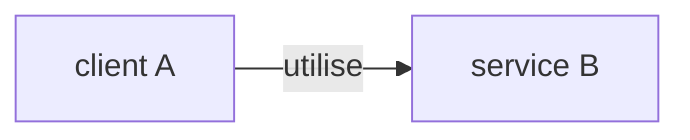
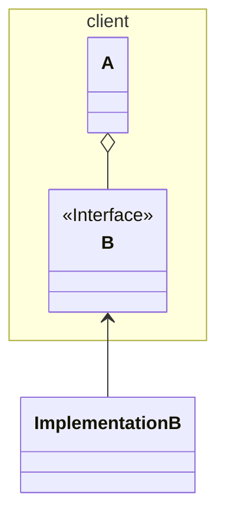

# Injection de dépendance
## scope
 - ce principe concerne les services (c'est-à-dire les objets définissant des comportements), lorsqu'un client A utilise un service B 

## principe
 - le client A ne doit pas importer directement l'implémentation du service B

